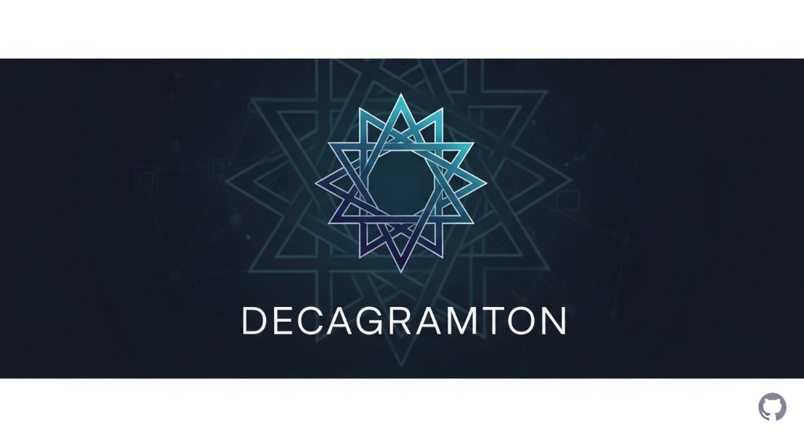

# <div align="center">ZetaGo-Aurum Decagramton</div>

<div align="center">




**The Ten-Pointed Star of Speed**
*Lightweight. Powerful. Perfection.*

[Installation](#installation) • [The 10 Stars](#-the-10-stars--10-bintang-kesempurnaan) • [System Features](#-system-features) • [Contributors](#contributors)

</div>

---

## 🚀 Installation

```bash
npm install @zetagoaurum-socket/decagramton
```

---

## 🌟 The 10 Stars / 10 Sudut Kesempurnaan

Decagramton is built on the philosophy of **10 points of perfection**.
*Decagramton dibangun berdasarkan filosofi 10 sudut kesempurnaan.*

| # | Feature | Description |
|---|---------|-------------|
| 1 | ⚡ **Lightweight Core** | Zero-bloat architecture for maximum speed & low memory. |
| 2 | 🛡️ **Anti-Crash System** | Robust error handling prevents unexpected terminations. |
| 3 | ✅ **Meta Verified Mimic** | Enterprise-grade attributes for message humanization. |
| 4 | 🚀 **Fast Connect** | Rapid socket establishment with optimized handshake. |
| 5 | 📱 **Multi-Device Native** | Full MD architecture compatibility, anti-disconnect. |
| 6 | 🔐 **Flexible Pairing** | QR + Custom Pairing Code support. |
| 7 | 💬 **Interactive Engine** | Buttons, Lists, Carousels, Polls via `dugong.js`. |
| 8 | 🔄 **Stable Sessions** | Self-healing, long-running session management. |
| 9 | 🔒 **Signal Encryption** | End-to-end encryption via Signal Protocol. |
| 10 | 🎨 **Premium Console** | Stylish Decagramton banner & colored logs. |

---

## ⚙️ System Features

> *Fitur-fitur sistem yang memperkuat 10 Sudut di atas.*

### 🔄 Auto-Update
Automatically detects and installs the latest NPM version on start-up. Your bot evolves without manual intervention.
*(Otomatis mendeteksi dan menginstal versi terbaru saat startup.)*

### 🤖 Smart Humanize Mimic
Intelligent anti-detection system that mimics human behavior patterns to avoid automation flags without sacrificing response speed.
*(Sistem anti-deteksi cerdas yang meniru pola perilaku manusia.)*

### ⏱️ Anti-Delay & Stable Ping
Optimized keep-alive and message queue ensures minimal latency and rock-solid connection stability.
*(Keep-alive dan antrian pesan yang dioptimalkan untuk latensi minimal.)*

### 🖥️ Server & Panel Friendly
Designed for deployment on shared hosting, VPS, and panel-based environments. Low resource footprint.
*(Dirancang untuk deployment di hosting, VPS, dan panel. Hemat resource.)*

### 🛡️ Enhanced Security
Multiple layers of protection including rate limiting, session encryption, and anti-spam shielding.
*(Proteksi berlapis termasuk rate limiter, enkripsi sesi, dan anti-spam.)*

---

## 👥 Contributors

<div align="center">
  <table>
    <tr>
      <td align="center">
        <a href="https://github.com/adiwajshing">
          
          <br /><sub><b>Adhiraj Singh</b></sub>
        </a>
        <br /><i>Original Creator</i>
      </td>
      <td align="center">
        <a href="https://github.com/ZetaGo-Aurum">
          
          <br /><sub><b>ZetaGo-Aurum</b></sub>
        </a>
        <br /><i>Current Maintainer</i>
      </td>
      <td align="center">
        <a href="https://github.com/FallEzz">
          
          <br /><sub><b>FallZx Infinity</b></sub>
        </a>
        <br /><i>Base Repository</i>
      </td>
      <td align="center">
        <a href="https://github.com/IbraDecode">
          
          <br /><sub><b>IbraDecode</b></sub>
        </a>
        <br /><i>Contributor</i>
      </td>
    </tr>
  </table>
</div>

---

<div align="center">
    © 2026 ZetaGo-Aurum. All Rights Reserved.
</div>
